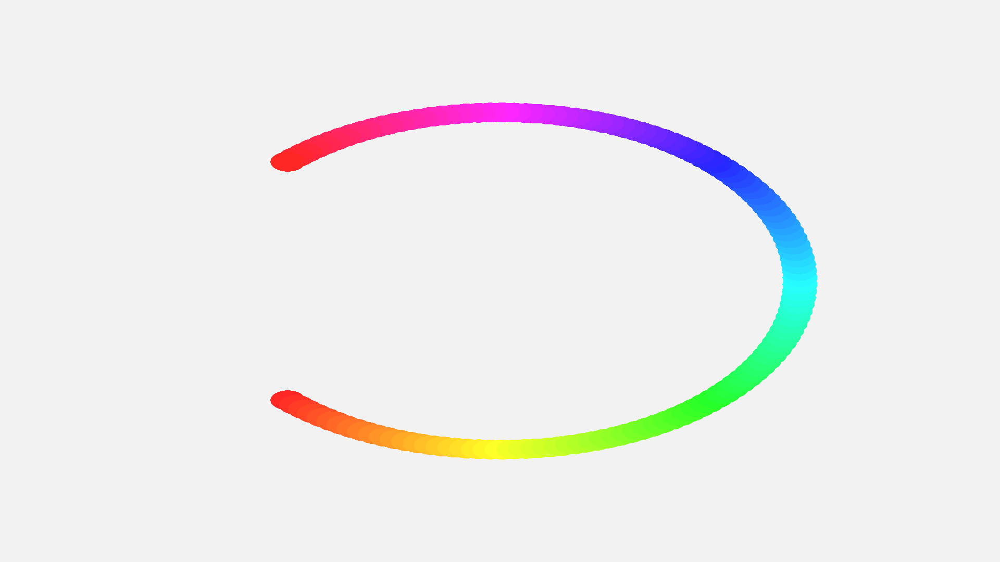
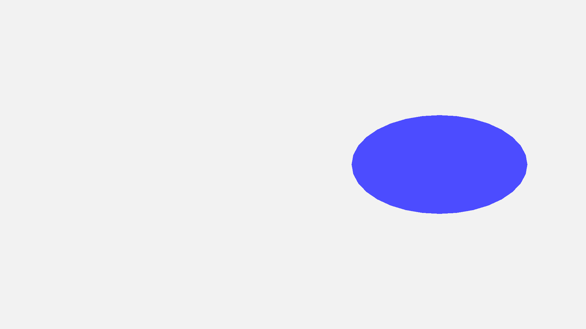
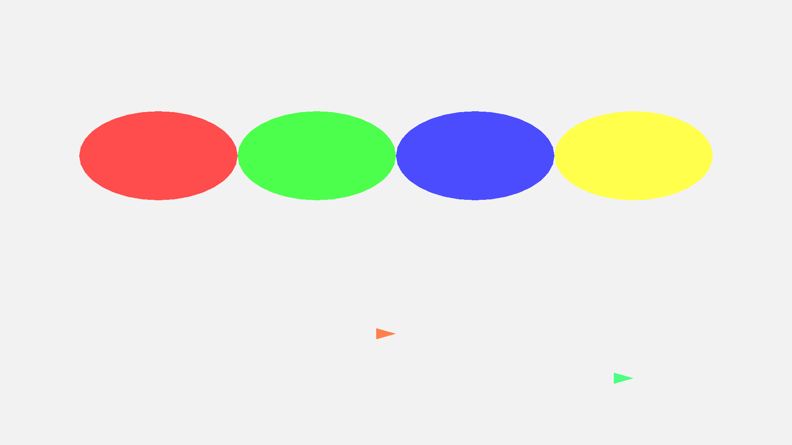
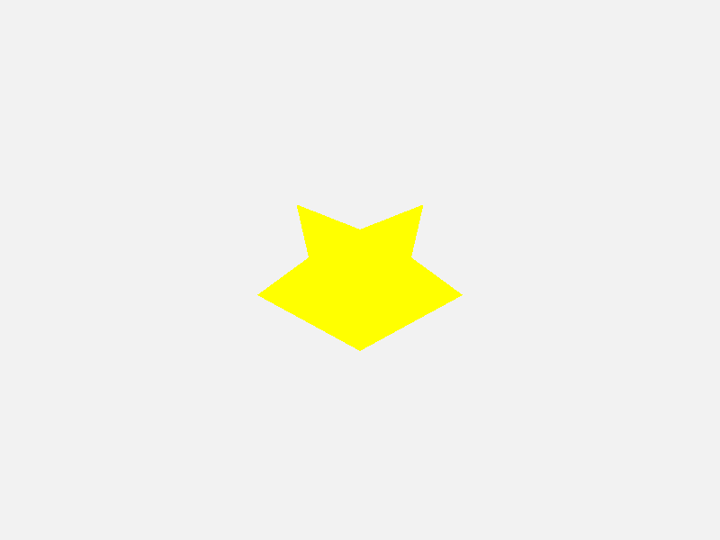
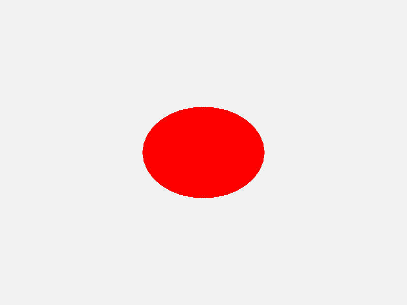
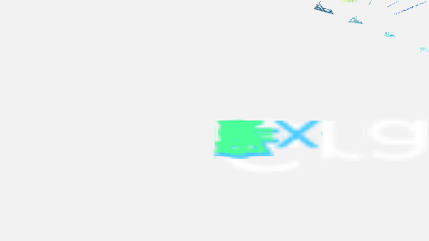

# 🎨 Diomanim - High-Performance Animation Engine

[](https://rust-lang.org)
[](https://wgpu.rs)
[](LICENSE)
[](#)

**Diomanim** is a high-performance animation engine built with Rust and WebGPU. Create mathematical animations with GPU-accelerated rendering, Manim-style effects, and export to high-quality MP4 videos.

## 🎬 Showcase

<p align="center">
  
  <br/>
  <em>120 circles, dynamic offsets, 60 FPS rendering - Apple Watch-style rainbow</em>
</p>

### Feature Gallery

| Shapes & Lines | Arrows | Star | Circle |
|----------------|--------|------|--------|
|  |  |  |  |

---

## ⚡ Performance

Real-world benchmarks on 1920x1080 resolution with 10 objects:

| Metric | Result |
|--------|--------|
| **Average FPS** | **551.6 FPS** |
| **Frame Time** | **1.81ms** (target: 16.67ms @ 60 FPS) |
| **Realtime Speedup** | **9.2x faster** than realtime |
| **Memory Usage** | **~50-100 MB** |
| **Tests Passing** | **50/50** ✅ |

**Performance Rating:** ⚡ **EXCELLENT - Real-time capable**

---

## ✨ Current Features

### 🎬 **Core Animation System**
- ✅ **Keyframe animation** - Property-based animation tracks
- ✅ **Phase 1 effects** - FadeIn, FadeOut, Create, Uncreate, Grow, Shrink
- ✅ **Phase 2 effects** - MoveTo, Shift, Rotate, Spin, Transform (NEW!)
- ✅ **Transform animations** - Position, rotation, scale
- ✅ **Easing functions** - Linear, EaseIn, EaseOut, EaseInOut
- ✅ **Opacity blending** - Full alpha channel support
- ✅ **Combined animations** - Multiple animations per object

### 🎨 **Shape Rendering**
- ✅ **Circle** - GPU-accelerated circle rendering
- ✅ **Rectangle** - Quad rendering with transforms
- ✅ **Polygon** - Regular polygons (pentagon, hexagon, etc.)
- ✅ **Star** - N-pointed stars with inner/outer radius
- ✅ **Line** - Configurable thickness
- ✅ **Arrow** - Lines with arrowheads

### 📐 **Mathematical Notation (NEW!)**
- ✅ **LaTeX syntax** - Render equations with LaTeX notation
- ✅ **Text rendering** - GPU-accelerated TrueType font rendering
- ✅ **Greek letters** - α, β, γ, δ, θ, λ, μ, π, σ, φ, ω
- ✅ **Operators** - ∇, Σ, Π, ∫, ∂, ±, ×, ·, ≤, ≥, ≠, ≈, ∞
- ✅ **Fractions** - `\frac{a}{b}`
- ✅ **Superscripts** - `x^2`, `e^{i\pi}`
- ✅ **Subscripts** - `x_1`, `a_n`
- ✅ **Square roots** - `\sqrt{x}`

### 🏗️ **Scene Graph**
- ✅ **Hierarchical nodes** - Parent-child relationships
- ✅ **Transform inheritance** - Automatic propagation
- ✅ **Multiple animations** - Per-object animation instances
- ✅ **Batch rendering** - Single GPU pass per frame

### 🎥 **Export**
- ✅ **PNG frames** - Individual frame export
- ✅ **MP4 video** - H.264 export via ffmpeg
- ✅ **Configurable quality** - CRF, resolution, FPS settings

### 🚀 **Technical**
- ✅ **WebGPU rendering** - Vulkan/Metal/DirectX 12
- ✅ **SIMD math** - Hardware-accelerated vector operations
- ✅ **Zero-copy rendering** - Efficient GPU buffer management
- ✅ **Type-safe** - Rust compile-time guarantees

---

## 📦 Installation

### Prerequisites
- **Rust 1.70+** - Install from [rustup.rs](https://rustup.rs/)
- **Git**
- **ffmpeg** (optional, for video export)

### Quick Start
```bash
git clone https://github.com/skyblanket/diomanim.git
cd diomanim
cargo build --release
```

---

## 🎬 Usage

### Run Examples

```bash
# Test animation effects (FadeIn, FadeOut, Create)
cargo run --release --example animation_test

# Full video export demo
cargo run --release --example video_export_demo

# Comprehensive showcase (all features)
cargo run --release --example showcase

# Phase 2 animation demo (MoveTo, Rotate, Spin, Transform)
cargo run --release --example phase2_demo

# Mathematical notation demo (LaTeX rendering)
cargo run --release --example math_demo

# 🔥 Gradient Descent Optimization (ML Visualization)
cargo run --release --example gradient_descent

# Performance benchmark
cargo run --release --example benchmark
```

### 🌟 Featured Example: Gradient Descent

Watch gradient descent optimization come to life with mathematical notation, animated convergence, and color-coded steps!



**🎬 Demo Video:** Successfully rendered! (180 frames @ 480x270, 30 FPS)

```bash
# Run live preview
cargo run --release --example gradient_descent

# Generate video frames (requires GPU)
cargo run --release --example gradient_descent_quick
```

**What it shows:**
- ∇f = 2x (gradient formula in LaTeX)
- x_{t+1} = x_t - α∇f (update rule)
- f(x) = x² loss function curve
- 6 optimization steps with animated arrows
- Color gradient showing convergence (blue → green)
- Step labels and smooth animations

**Performance:** Rendered 180 frames in 14.4s (12.5 FPS avg)

Perfect for ML education and algorithm visualization!

### Create Your Own Animation

```rust
use diomanim::prelude::*;
use diomanim::animation::effects;
use diomanim::scene::{SceneGraph, Renderable};

#[tokio::main]
async fn main() -> Result<(), Box<dyn std::error::Error>> {
    // Initialize renderer
    let renderer = ShapeRenderer::new(1920, 1080).await?;

    // Create scene
    let mut scene = SceneGraph::new();

    // Add animated circle
    let circle_id = scene.create_node_with_transform(
        "My Circle".to_string(),
        Transform::from_translation(0.0, 0.0, 0.0),
    );

    scene.get_node_mut(circle_id).unwrap().set_renderable(
        Renderable::Circle {
            radius: 0.2,
            color: Color::RED,
        }
    );

    // Add FadeIn animation
    let fade_in = effects::fade_in(2.0);
    scene.get_node_mut(circle_id).unwrap()
        .add_animation(AnimationInstance::new(fade_in, TimeValue::new(0.0)));

    // Render frames...
    // See examples/ for complete code

    Ok(())
}
```

---

## 🏗️ Architecture

```
diomanim/
├── src/
│   ├── core/               # Foundation systems
│   │   ├── vector.rs       # SIMD-accelerated Vector3
│   │   ├── color.rs        # Color management
│   │   ├── transform.rs    # Position/rotation/scale
│   │   ├── camera.rs       # Camera system
│   │   └── time.rs         # Timing utilities
│   ├── animation/          # Animation system
│   │   ├── property.rs     # Keyframe tracks
│   │   ├── effects.rs      # Pre-built effects
│   │   └── easing.rs       # Easing functions
│   ├── scene/              # Scene graph
│   │   └── mod.rs          # Hierarchical nodes
│   ├── mobjects/           # Shape primitives
│   │   └── mod.rs          # Circle, Polygon, etc.
│   ├── render/             # GPU rendering
│   │   ├── mod.rs          # WebGPU renderer
│   │   └── shaders/        # WGSL shaders
│   └── export/             # Video export
│       └── mod.rs          # MP4 export via ffmpeg
└── examples/               # Example animations
    ├── animation_test.rs   # Effects demo
    ├── showcase.rs         # Complete demo
    └── benchmark.rs        # Performance test
```

---

## 📊 Performance Details

### Rendering Performance
- **551.6 FPS average** at 1920x1080 with 10 objects
- **1.81ms per frame** (well below 16.67ms @ 60 FPS target)
- **9.2x realtime rendering** - 5 seconds of video in 0.54 seconds
- **GPU-accelerated** via WebGPU (Vulkan/Metal/DX12)

### Animation System
- **Property-based keyframes** - Animate any transform property
- **Linear interpolation** with easing support
- **Multiple tracks per object** - Position, scale, opacity simultaneously
- **Efficient sampling** - O(log n) keyframe lookup

### Memory Efficiency
- **~50-100 MB** for typical scenes
- **Zero-copy GPU buffers** - Direct memory mapping
- **Automatic cleanup** - Rust's ownership model

---

## 🎨 Animation Effects

All effects are production-ready and tested:

### Basic Effects
```rust
use diomanim::animation::effects;

// Fade in from transparent to opaque
let fade_in = effects::fade_in(2.0);

// Fade out from opaque to transparent
let fade_out = effects::fade_out(2.0);

// Combined fade in + scale from zero
let create = effects::create(2.0);

// Reverse of create
let uncreate = effects::uncreate(2.0);
```

### Transform Effects
```rust
// Scale from 0 to 1
let grow = effects::grow_from_center(2.0);

// Scale from 1 to 0
let shrink = effects::shrink_to_center(2.0);

// Fade in, hold, fade out
let fade_in_out = effects::fade_in_out(1.0, 2.0, 1.0);
```

### Phase 2 Motion Effects
```rust
// Move to a specific position
let move_anim = effects::move_to(
    Vector3::new(-1.0, 0.0, 0.0),  // from
    Vector3::new(1.0, 0.0, 0.0),   // to
    2.0                             // duration
);

// Rotate to a specific angle
let rotate_anim = effects::rotate(
    0.0,                           // from angle
    std::f32::consts::PI,          // to angle (180°)
    1.5                            // duration
);

// Spin continuously
let spin_anim = effects::spin(
    3.0,  // number of full rotations
    4.0   // duration
);

// Combined transform (position + scale + rotation)
let transform_anim = effects::transform(
    Vector3::zero(),               // from position
    Vector3::new(1.0, 1.0, 0.0),  // to position
    Vector3::one(),                // from scale
    Vector3::new(2.0, 2.0, 1.0),  // to scale
    0.0,                           // from rotation
    std::f32::consts::PI * 2.0,   // to rotation (360°)
    3.0                            // duration
);
```

### Custom Animations
```rust
use diomanim::animation::property::{AnimationClip, AnimationTrack, Keyframe};

let mut clip = AnimationClip::new("custom".to_string());
let mut track = AnimationTrack::new("position".to_string());

// Add keyframes
track.add_keyframe(Keyframe::new(
    TimeValue::new(0.0),
    Vector3::new(-1.0, 0.0, 0.0)
));
track.add_keyframe(Keyframe::new(
    TimeValue::new(2.0),
    Vector3::new(1.0, 0.0, 0.0)
));

clip.add_track(track);
```

---

## 🎥 Video Export

Export your animations to high-quality MP4 videos:

```rust
use diomanim::export::export_video;

// Export frames to MP4
export_video(
    "output/frames",       // Input frames directory
    "output/video.mp4",    // Output video path
    1920,                  // Width
    1080,                  // Height
    60                     // FPS
)?;
```

**Requirements:**
- ffmpeg must be installed on your system
- Frames must follow pattern: `frame_0000.png`, `frame_0001.png`, etc.

**Export Settings:**
- **Codec:** H.264
- **Pixel Format:** YUV420p (universal compatibility)
- **Quality:** CRF 18 (visually lossless)
- **Preset:** Slow (better compression)

---

## 🧪 Testing

Run the full test suite:

```bash
# All tests
cargo test --release

# With output
cargo test --release -- --nocapture

# Specific test
cargo test test_name
```

**Current Test Coverage:**
- ✅ 50 unit tests passing
- ✅ 8 doc tests passing
- ✅ Integration tests for all shape types
- ✅ Animation system tests (Phase 1 & Phase 2)
- ✅ Scene graph tests
- ✅ Transform inheritance tests

---

## 🛠️ Development

### Project Structure

```
diomanim/
├── Cargo.toml          # Dependencies
├── build.sh            # Build script
├── examples/           # Example animations
├── src/                # Source code
│   ├── lib.rs          # Library entry point
│   ├── main.rs         # Demo application
│   └── */              # Module directories
└── tests/              # Integration tests (future)
```

### Build Commands

```bash
# Development build
cargo build

# Release build (optimized)
cargo build --release

# Run with hot-reload (future)
dx serve --desktop --hot-reload

# Check without building
cargo check

# Format code
cargo fmt

# Lint
cargo clippy -- -D warnings
```

---

## 📈 Roadmap

### ✅ Phase 1 - Core Engine (COMPLETE)
- [x] WebGPU rendering pipeline
- [x] Scene graph with hierarchy
- [x] All shape types (Circle, Rectangle, Polygon, etc.)
- [x] Keyframe animation system
- [x] Animation effects (FadeIn, FadeOut, Create)
- [x] Easing functions
- [x] Opacity support
- [x] PNG frame export
- [x] MP4 video export

### 🚀 Phase 2 - Advanced Animations (COMPLETE)
- [x] MoveTo - Position animations
- [x] Rotate - Rotation animations
- [x] Spin - Continuous rotation
- [x] Transform - Combined position/scale/rotation
- [x] Shift - Offset movement

### 🎯 Phase 3 - Advanced Features (Future)
- [ ] Text rendering (fonts, LaTeX)
- [ ] Real-time preview window
- [ ] Camera animations
- [ ] 3D rendering support
- [ ] Particle systems

### 🌟 Phase 4 - Editor & Tools (Future)
- [ ] GUI editor with timeline
- [ ] Interactive preview
- [ ] Visual keyframe editing
- [ ] Project file format
- [ ] Templates & presets

---

## 🤝 Contributing

Contributions are welcome! See [CONTRIBUTING.md](CONTRIBUTING.md) for guidelines.

### Development Setup

```bash
git clone https://github.com/skyblanket/diomanim.git
cd diomanim
git checkout -b feature/my-feature

# Make changes, test
cargo test
cargo run --example showcase

# Commit
git commit -am "Add feature"
git push origin feature/my-feature
```

---

## ⚖️ License

**MIT License** - See [LICENSE](LICENSE) file for details.

You are free to:
- ✅ Use commercially
- ✅ Modify and distribute
- ✅ Use in proprietary projects
- ✅ Use in open source projects

---

## 📞 Support

- **Issues:** [GitHub Issues](https://github.com/skyblanket/diomanim/issues)
- **Discussions:** [GitHub Discussions](https://github.com/skyblanket/diomanim/discussions)

---

## 🎯 Why Diomanim?

### For Animation Creators
- ⚡ **9.2x faster** than realtime rendering
- 🎨 **Professional quality** output
- 🔄 **Efficient workflow** - iterate quickly
- 💾 **Small memory footprint** (~50-100 MB)

### For Developers
- 🦀 **Rust** - Memory safety, zero-cost abstractions
- 🚀 **WebGPU** - Modern, cross-platform GPU API
- 🧪 **Well-tested** - 50 tests, all passing
- 📦 **Clean architecture** - Easy to extend

### For Educators
- 🎓 **Mathematical animations** - Clear visualizations
- 📽️ **High-quality videos** - Professional output
- 🔬 **Precise control** - Frame-perfect accuracy
- 🌍 **Cross-platform** - Windows, macOS, Linux

---

## 🚀 Get Started

```bash
git clone https://github.com/skyblanket/diomanim.git
cd diomanim
cargo run --release --example showcase
```

**Experience the power of Rust + WebGPU for animation!** ✨

---

<div align="center">

**Diomanim** - *High-performance animation engine built with Rust*

Made with ❤️ in Rust

</div>
